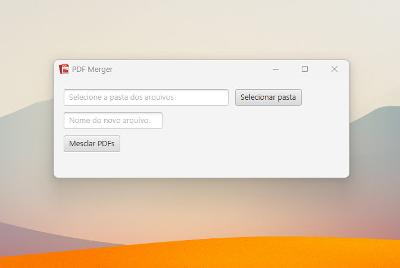

# PDF Merger 
 

# Sobre o projeto

Projeto idealizado para facilitar a junção de arquivos PDFs, sem depender de ferramentas online.

A aplicação consiste em combinar arquivos pdf, sem a necessidade de conexão com a internet.
Adicionada interface gráfica, com a utilização da biblioteca JavaFX, que permite a criação de interfaces gráficas de usuário
ricas.

Para o projeto em quaestão foi pensada uma interface simples e de fácil entendimento ao usuário.

# Tecnologias utilizadas
## Back end
- Java
- PDFBox
- Maven
- JavaFX

# Autor

Paulo Jonas

https://www.linkedin.com/in/paulo-jonas